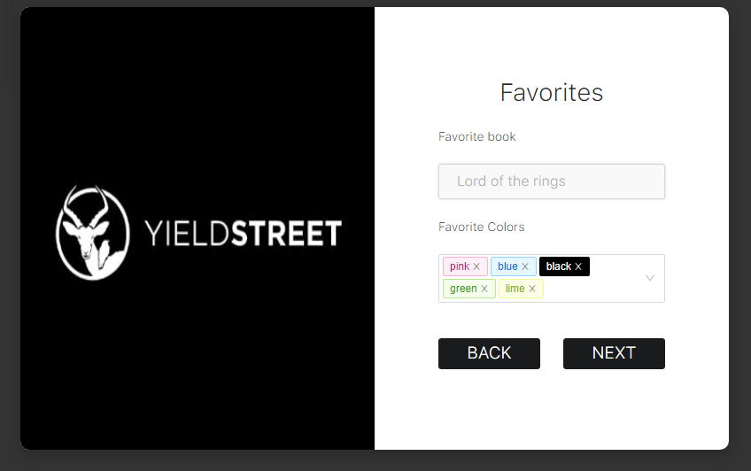
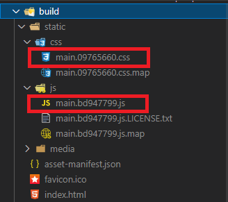
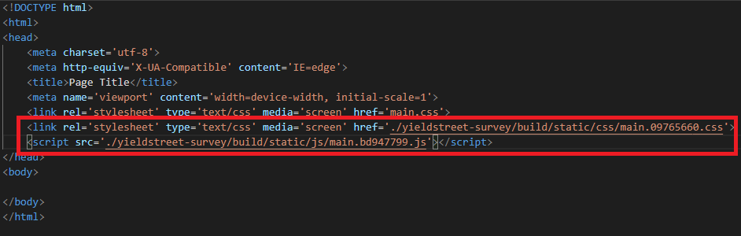

<h1 align="center">
    Survey app
</h1>

<p align="center">
  <a href="https://yeidlstreet-survey.netlify.app/">
    
  </a>
</p>

<p align="center">
  <a href="https://yeidlstreet-survey.netlify.app/">
    
  </a>
</p>

## Features
- Allow users to save data on local storage
- When closing the survey the user get's to the step where they were
- After submitting, the survey will not be opned unless the local storage is cleared


## :rocket: Technologies

- [ReactJS](https://reactjs.org/)
- [Typescript][ts]
- [styled-components](https://www.styled-components.com/)
- [ant-design](https://ant.design/docs/react/introduce)
- [react-spring](https://react-spring.io/)
- [react-redux](https://react-redux.js.org/)
- [VS Code][vscode] 

## :information_source: How To Use

To clone and run this application, you'll need [Git](https://git-scm.com), [Node.js v10.16][nodejs] or higher + [Yarn v1.13][yarn] or higher installed on your computer. From your command line:

```bash
# Clone this repository
$ git clone https://github.com/marcelotc/survey-app.git

# Go into the repository
$ cd survey-app

# Install dependencies
$ yarn install

# Run the project
$ yarn start
```

## :information_source: How To Build

To build the project and be able to include in a HTML file do the following:

```bash
$ yarn build
```

After that, the build will generate a main.(hash).css and main.(hash).js bundle:
  

  
Include it in your HTML file as the image shows bellow:
  


## :white_check_mark: To run tests

```bash
$ yarn test
```

Made with ♥ by Marcelo T. Cortes :wave:

[ts]: https://www.typescriptlang.org
[vscode]: https://code.visualstudio.com/
[yarn]: https://yarnpkg.com/
[vceditconfig]: https://marketplace.visualstudio.com/items?itemName=EditorConfig.EditorConfig
[vceslint]: https://marketplace.visualstudio.com/items?itemName=dbaeumer.vscode-eslint
